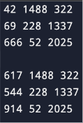

# Лабораторная работа 1
## Тема работы: Программирование. Язык СИ. Математические операции. Переменные и их типы. Операторы. Циклы. Простые условные конструкции. Основы работы со статическими массивами.
### Комплект 1: Начало программирования. Операторы, вычисления, ввод-вывод.

### Задача 1.2
#### Постановка задачи
Написать простую программу. Ввести два числа с клавиатуры, вычислить их сумму и напечатать результат. Использовать функцию printf для приглашений на ввод и для распечатки результата. Использовать функцию scanf для ввода каждого числа отдельно с клавиатуры. Для получения доступа к функциям printf и scanf включить в программу заголовочный файл stdio.h. Использовать корректные спецификаторы форматирования. Здесь и далее для распечатки надписей на экране использовать латинские буквы для избежания проблем с кодировками символов.
#### Математическая модель
Вычислить a + b, где \
a – первое вводимое число с клавиатуры \
b – второе вводимое число с клавиатуры
#### Список идентификаторов
| Имя | Тип | Смысл |
| - | - | - |
| a | int | Первое число |
| b | int | Второе число |
| sum | int | Сумма |
#### Код программы
```c
#include <stdio.h>

int main() {
    int a, b;
    printf("Enter the first number: ");
    scanf("%d", &a);
    printf("Enter the second number: ");
    scanf("%d", &b);
    int sum = a + b;
    printf("Sum: %d", sum);
}
```
#### Результат работы


### Задача 1.3
#### Постановка задачи
Вычислить значение выражения:
```math
u(x,y) = \frac{1 + \sin^2(x + y)}
{2 + \left| x - \frac{2x^2}{1 + |\sin(x + y)|} \right|}
```
введя x и y с клавиатуры. Подберите значения аргументов x и y самостоятельно за исключением тривиальных значений. Напечатайте
вычисленное значение u(x, y) на экране. Включить в программу заголовочный файл math.h для доступа к математическим функциям.
#### Математическая модель
```math
u(x,y) = \frac{1 + \sin^2(x + y)}
{2 + \left| x - \frac{2x^2}{1 + |\sin(x + y)|} \right|}
```
x, y – числа, введенные с клавиатуры
#### Список идентификаторов
| Имя | Тип | Смысл |
| - | - | - |
| u | float | Результат |
| x | float | Первый аргумент |
| y | float | Второй аргумент |
#### Код программы
```c
#include <stdio.h>
#include <math.h>

int main() {
    float x, y;
    printf("Enter x: ");
    scanf("%f", &x);
    printf("Enter y: ");
    scanf("%f", &y);
    float u = (1 + sinf(x + y) * sinf(x + y)) / (2 + fabsf(x - (2*x*x / (1 + fabsf(sinf(x + y))))));
    printf("u(x,y) = %f", u);
}
```
#### Результат работы


### Задача 1.4
#### Постановка задачи
Вычислить значение выражения: 
```math
h(x) = - \frac{x-a}{\sqrt[3]{x^2+a^2}} - \frac{4\sqrt[4]{(x^2+b^2)^3}}{2+a+b+\sqrt[3]{(x-c)^2}}
```
Выполнить для следующих значений: \
a = 0.12, b = 3.5, c = 2.4, x = 1.4 \
a = 0.12, b = 3.5, c = 2.4, x = 1.6 \
a = 0.27, b = 3.9, c = 2.8, x = 1.8 

Значения параметров и аргументов можно вводить прямо в коде программы без ввода с клавиатуры.
#### Математическая модель
```math
h(x) = - \frac{x-a}{\sqrt[3]{x^2+a^2}} - \frac{4\sqrt[4]{(x^2+b^2)^3}}{2+a+b+\sqrt[3]{(x-c)^2}}
```
a = 0.12, b = 3.5, c = 2.4, x = 1.4 \
a = 0.12, b = 3.5, c = 2.4, x = 1.6 \
a = 0.27, b = 3.9, c = 2.8, x = 1.8 

#### Список идентификаторов
| Имя | Тип | Смысл |
| - | - | - |
| a | float | Первый параметр |
| b | float | Второй параметр |
| c | float | Третий параметр |
| x | float | Аргумент |
| h | float | Результат |
#### Код программы
```c
#include <stdio.h>
#include <math.h>

int main() {
    float a, b, c, x, h;
    a = 0.12;
    b = 3.5;
    c = 2.4;
    x = 1.4;
    h = - ((x - a) / pow(x*x + a*a, 1.0/3.0)) - (4 * pow(pow(x*x + b*b, 3), 1.0/4.0) / (2 + a + b + pow((x - c) * (x - c), 1.0/3.0)));
    printf("h(x) = %f", h);
}
```
#### Результат работы
 \
 \


### Комлект 2: Организация циклов. Условные конструкции.
### Задача 2.1
#### Постановка задачи
Вычислить используя цикл for координаты планеты Марс относительно Земли с течением времени t. Распечатать на экране координаты для каждой итерации по t. Координаты планеты Марс для каждой итерации задаются заданы формулами:
$$
\begin
x = r_{1}cos(w_{1}t) - r_{2}cos(w_{2}t) \\
u = r_{1}sin(w_{1}t) - r_{2}sin(w_{2}t) \\
w_{1} = \frac{2\pi}{T_{1}} \\
w_{2} = \frac{2\pi}{T_{2}}
\end
$$
где r1 – радиус орбиты Марса, r2 – радиус орбиты Земли, T1 и T2 — периоды обращения указанных планет соответственно, t – каждый заданный момент времени внутри цикла по времени. Подберите подходящие единицы измерения для времени и расстояния.
#### Математическая модель
```math
x = r_{1}cos(w_{1}t) - r_{2}cos(w_{2}t) \\
u = r_{1}sin(w_{1}t) - r_{2}sin(w_{2}t) \\
w_{1} = \frac{2\pi}{T_{1}} \\
w_{2} = \frac{2\pi}{T_{2}}
```
r<sub>1</sub> = 227.9e6, r<sub>2</sub> = 149.6e6 \
T<sub>1</sub> = 687, T<sub>2</sub> = 365

#### Список идентификаторов
| Имя | Тип | Смысл |
| - | - | - |
| r1 | float | Радиус Марса |
| r2 | float | Радиус Земли |
| T1 | float | Период обращения Марса |
| T2 | float | Период обращения Земли |
| w1 | float | Угловая скорость Марса |
| w2 | float | Угловая скорость Земли |
| x | float | Координата x |
| y | float | Координата y |
| t | int | Шаг цикла |

#### Код программы
```c
#include <stdio.h>
#include <math.h>

int main() {
    float r1, r2, T1, T2, w1, w2, x, y;
    r1 = 227.9e6;
    r2 = 149.6e6;
    T1 = 687.0;
    T2 = 365.0;
    w1 = 2 * M_PI / T1;
    w2 = 2 * M_PI / T2;
    for (int t = 0; t <= 100; t++) {
        x = r1 * cos(w1 * t) - r2 * cos(w2 * t);
        y = r1 * sin(w1 * t) - r2 * sin(w2 * t);
        printf("x: %f y: %f\n", x, y);
    }
}
```
#### Результат работы

### Задача 2.2
#### Постановка задачи
Вычислить определённый интеграл от заданной функции методом трапеций:
```math
\int_{a}^{b}f(x)dx = \int_{a}^{b}e^{x+2}dx
```
Функция f(x) может быть выбрана и самостоятельно. Результат интегрирования сравнить с вычисленным вручную и убедиться в корректности результата.
#### Математическая модель
```math
\int_{a}^{b}f(x)dx = \int_{a}^{b}e^{x+2}dx
```
#### Список идентификаторов
| Имя | Тип | Смысл |
| - | - | - |
| a | float | Нижний предел |
| b | float | Верхний предел |
| h | float | Шаг цикла |
| result | float | Результат |
| x | float | Аргумент цикла |
| n | int | Количество шагов |
#### Код программы
```c
#include <stdio.h>
#include <math.h>

int main() {
    float a, b, h, result, x;
    int n;
    printf("Enter the lower limit: ");
    scanf("%f", &a);
    printf("Enter the upper limit: ");
    scanf("%f", &b);
    printf("Enter number of steps: ");
    scanf("%d", &n);
    h = (b - a) / n;
    result = (exp(a + 2) + exp(b + 2)) / 2;
    for (x = a + h; x < b - h; x += h) {
        result += exp(x + 2);
    }
    result *= h;
    printf("Result: %f", result);
}
```
#### Результат работы

### Задача 2.3
#### Постановка задачи
Организовать и распечатать последовательность чисел Падована, не превосходящих число m, введенное с клавиатуры. Числа Падована представлены следующим рядом: 1, 1, 1, 2, 2, 3, 4, 5, 7, 9, 12, 16, 21, 28, 37, 49, 65, 86, 114, 151, 200, 265, ... Использовать конструкцию for и простые варианты условной конструкции if else. Для этих чисел заданы формулы:

P(0) = P(1) = P(2) = 1 \
P(n) = P(n - 2) + P(n-3)

#### Математическая модель
P(0) = P(1) = P(2) = 1 \
P(n) = P(n - 2) + P(n-3)

#### Список идентификаторов
| Имя | Тип | Смысл |
| - | - | - |
| m | int | Вводимое число |
| i | int | Шаг цикла |
| p0 | int | Первое число последовательности |
| p1 | int | Второе число последовательности |
| p2 | int | Третье число последовательности |
| p | int | Вычисляемое число последовательности |
#### Код программы
```c
#include <stdio.h>
#include <math.h>

int main() {
    int m, i, p0, p1, p2, p;
    printf("Enter a number: ");
    scanf("%d", &m);
    p0 = p1 = p2 = 1;
    if (m >= 1) {
        printf("%d %d %d ", p0, p1, p2);
    }
    for (int i = 3; ; i++) {
        p = p0 + p1;
        if (p > m) {
            break;
        }
        printf("%d ", p);
        p0 = p1;
        p1 = p2;
        p2 = p;
    }
}
```
#### Результат работы

### Задача 2.4
#### Постановка задачи
С клавиатуры вводится трёхзначное число, считается сумма его цифр. Если сумма цифр числа больше 10, то вводится следующее трёхзначное число, если сумма меньше либо равна 10 — программа завершается.

#### Математическая модель
sum = n % 10 + n / 10 % 10 + n / 100 % 10, где
n – число, введеное с клавиатуры
#### Список идентификаторов
| Имя | Тип | Смысл |
| - | - | - |
| n | int | Трёхзначное число |
| sum | int | Сумма цифр n |
#### Код программы
```c
#include <stdio.h>

int main() {
    int n, sum;
    printf("Enter a three-digit number: ");
    scanf("%3d", &n);
    while (1) {
        sum = n % 10 + n / 10 % 10 + n / 100 % 10;
        if (sum > 10) {
            printf("Enter a three-digit number: ");
            scanf("%3d", &n);
        } else {
            printf("Program completed");
            break;
        }
    }
}
```
#### Результат работы

### Комплект 3: Основы работы со статическими массивами.
### Задача 3.1
#### Постановка задачи
Для некоторого числового вектора X, введённого с клавиатуры, вычислить значения вектора Y = X · X (y<sub>i</sub> = x<sub>i</sub> · x<sub>i</sub>  — поэлементно).

#### Математическая модель
y<sub>i</sub> = x<sub>i</sub> · x<sub>i</sub>, где
x<sub>i</sub> – число, введенное с клавиатуры

#### Список идентификаторов
| Имя | Тип | Смысл |
| - | - | - |
| X[5] | int | Вектор X |
| Y[5] | int | Вектор Y |
| i | int | Шаг цикла |
#### Код программы
```c
#include <stdio.h>

int main() {
    int X[5], Y[5];
    for (int i = 0; i <= 5 - 1; i++) {
        printf("X[%d]: ", i);
        scanf("%d", &X[i]);
        Y[i] = X[i] * X[i];
    }
    printf("X: ");
    for (int i = 0; i <= 5 - 1; i++) {
        printf("%d ", X[i]);
    }
    printf("\nY: ");
    for (int i = 0; i <= 5 - 1; i++) {
        printf("%d ", Y[i]);
    }
}
```
#### Результат работы

### Задача 3.2
#### Постановка задачи
Для некоторого числового массива X, введённого с клавиатуры поэлементно, изменить порядок элементов на обратный и распечатать результат на экране.
#### Математическая модель
Заданный массив = {x<sub>1</sub>, x<sub>2</sub>, ..., x<sub>n</sub>} \
Результат = {x<sub>n</sub>, ..., x<sub>2</sub>, x<sub>1</sub>}
#### Список идентификаторов
| Имя | Тип | Смысл |
| - | - | - |
| X[5] | int | Массив чисел |
| i | int | Шаг цикла |
#### Код программы
```c
#include <stdio.h>

int main() {
    int X[5];
    for (int i = 0; i <= 5 - 1; i++) {
        printf("X[%d]: ", i);
        scanf("%d", &X[i]);
    }
    printf("X: ");
    for (int i = 4; i >= 0; i--) {
        printf("%d ", X[i]);
    }
}
```
#### Результат работы

### Задача 3.3
#### Постановка задачи
Транспонировать матрицу:
```math
A = \begin{bmatrix}
1 & 2 & 3 \\
4 & 5 & 6 \\
7 & 8 & 9
\end{bmatrix}
```
#### Математическая модель
Заданная матрица: \
$`
A = \begin{bmatrix}
1 & 2 & 3 \\
4 & 5 & 6 \\
7 & 8 & 9
\end{bmatrix}
`$ \
Результат: \
$`
A = \begin{bmatrix}
1 & 4 & 7 \\
2 & 5 & 8 \\
3 & 6 & 9
\end{bmatrix}
`$
#### Список идентификаторов
| Имя | Тип | Смысл |
| - | - | - |
| A[3][3] | int | Матрица А |
| i | int | Шаг цикла для строк |
| j | int | Шаг цикла для столбцов |
#### Код программы
```c
#include <stdio.h>

int main() {
    int A[3][3] = {1, 2, 3, 4, 5, 6, 7, 8, 9};
    printf("Matrix A\n");
    for (int i = 0; i <= 3 - 1; i++) {
        for (int j = 0; j <= 3 - 1; j++) {
            printf("%d ", A[i][j]);
        }
        printf("\n");
    }
    printf("\nTransposed matrix A\n");
     for (int i = 0; i <= 3 - 1; i++) {
        for (int j = 0; j <= 3 - 1; j++) {
            printf("%d ", A[j][i]);
        }
        printf("\n");
    }
}
```
#### Результат работы

### Задача 3.4
#### Постановка задачи
Преобразовать исходную матрицу так, чтобы первый элемент каждой строки был заменён средним арифметическим элементов этой строки.
#### Математическая модель
Заданная матрица: \
$`
A = \begin{bmatrix}
a_{11} & a_{12} & a_{13} \\
a_{21} & a_{22} & a_{23} \\
a_{31} & a_{32} & a_{33}
\end{bmatrix}
`$ \
Результат: \
$`
A = \begin{bmatrix}
\frac{a_{11}+a_{12}+a_{13}}{3} & a_{12} & a_{13} \\
\frac{a_{21}+a_{22}+a_{23}}{3} & a_{22} & a_{23} \\
\frac{a_{31}+a_{32}+a_{33}}{3} & a_{32} & a_{33}
\end{bmatrix}
`$
#### Список идентификаторов
| Имя | Тип | Смысл |
| - | - | - |
| A[3][3] | int | Матрица А |
| i | int | Шаг цикла для строк |
| j | int | Шаг цикла для столбцов |
#### Код программы
```c
#include <stdio.h>

int main() {
    int A[3][3] = {42, 1488, 322, 69, 228, 1337, 666, 52, 2025};
    for (int i = 0; i <= 3 - 1; i++) {
        for (int j = 0; j <= 3 - 1; j++) {
            printf("%d ", A[i][j]);
        }
        printf("\n");
    }
    printf("\n");
    for (int i = 0; i <= 3 - 1; i++) {
        for (int j = 0; j <= 3 - 1; j++) {
            if (j == 0) {
                A[i][j] = (A[i][j] + A[i][j+1] + A[i][j+2]) / 3;
                printf("%d ", A[i][j]);
            } else {
                printf("%d ", A[i][j]);
            }
        }
        printf("\n");
    }
}
```
#### Результат работы

### Задача 3.5
#### Постановка задачи
Реализовать самостоятельно алгоритм сортировки вставками (без создания своих функций, внутри функции main).

#### Математическая модель
A_step = A[j-1] \
A[j-1] = A[j] \
A[j] = A_step
#### Список идентификаторов
| Имя | Тип | Смысл |
| - | - | - |
| A[8] | int | Массив чисел |
| A_step | int | Переменная для сортировки |
| i | int | Шаг цикла |
| j | int | Шаг цикла |
#### Код программы
```c
#include <stdio.h>

int main() {
    int A[8] = {34, 11, -5, 65, 33, 2, 100, 28};
    int A_step;
    printf("Array\n");
    for (int i = 0; i <= 8 - 1; i++) {
        printf("%d ", A[i]);
    }
    for (int i = 0; i <= 8 - 1; i++) {
        for (int j = i; j > 0 && A[j-1]>A[j]; j--) {
            A_step = A[j-1];
            A[j-1] = A[j];
            A[j] = A_step;
        }
    }
    printf("\n\nResult\n");
    for (int i = 0; i <= 8 - 1; i++) {
        printf("%d ", A[i]);
    }
}
```
#### Результат работы


### Ефимов Сергей Робертович, 1 курс, ИВТ-2, подгруппа 3
