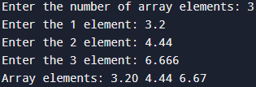

# Лабораторная работа 2
## Тема работы: Указатели, арифметика указателей.
### Задача 1
#### Постановка задачи 
Внутри функции int main(void) { /*...*/ } определите указатель double ***pointer = NULL;. Инициализируйте этот указатель адресом другого указателя типа double **, который указывает на переменную double *, которая указывает на double. Используйте pointer для записи и чтения значения 2.0 в сегмент оперативной памяти для double.
#### Математическая модель
double*** pointer --> double** --> double* --> double = 2.0
#### Список идентификаторов
| Имя | Тип | Смысл |
| - | - | - |
| ***pointer | double | Указатель |


#### Код программы
```c
#include <stdio.h>
#include <stdlib.h>
int main(void){
    double ***pointer = NULL;

    *( *( *( pointer = (double ***) malloc(sizeof(double **))) = (double **)malloc(sizeof(double *)) ) = (double *)malloc(sizeof(double)) ) = 2.0;

     printf("%lf\n", ***pointer);
     free(**pointer);
     free(*pointer);
     free(pointer);
    return 0;
}
```
#### Результат работы

### Задача 2
#### Постановка задачи
Напишите программу, которая складывает два числа с использованием указателей на эти числа.
#### Математическая модель
sum = *pa + *pb, где
*pa, *pb - указатели на a, b

#### Список идентификаторов
| Имя | Тип | Смысл |
| - | - | - |
| a | int | Первое число |
| b | int | Второе число |
| *pa | int | Указатель на первое число|
| *pb | int | Указатель на второе число |
| sum | int | Сумма |
#### Код программы
```c
#include <stdio.h>

int main() {
    int a, b;
    int *pa, *pb;
    pa = &a;
    pb = &b;
    printf("Enter the first number: ");
    scanf("%d", pa);
    printf("Enter the second number: ");
    scanf("%d", pb);
    int sum = *pa + *pb;
    printf("Sum: %d", sum);
}
```
#### Результат работы

### Задача 3
#### Постановка задачи
Напишите программу, которая находит максимальное число из двух чисел, используя указатели на эти числа.
#### Математическая модель
Вывести pa, если pa >= pb
Иначе вывести pb
#### Список идентификаторов
| Имя | Тип | Смысл |
| - | - | - |
| a | int | Первое число |
| b | int | Второе число |
| *pa | int | Указатель на первое число |
| *pb | int | Указатель на второе число |
#### Код программы
```c
#include <stdio.h>

int main() {
    int a, b;
    int *pa, *pb;
    pa = &a;
    pb = &b;
    printf("Enter the first number: ");
    scanf("%d", pa);
    printf("Enter the second number: ");
    scanf("%d", pb);
    if (*pa >= *pb) {
        printf("Max: %d", *pa);
    } else {
        printf("Max: %d", *pb);
    }
}
```
#### Результат работы

### Задача 4
#### Постановка задачи
Напишите программу, которая создаёт одномерный динамический массив из чисел с плавающей точкой двойной точности, заполняет его значениями с клавиатуры и распечатывает все элементы этого массива, используя арифметику указателей (оператор +), а не оператор доступа к элементу массива [].
#### Математическая модель
#### Список идентификаторов
| Имя | Тип | Смысл |
| - | - | - |
| n | int | Количество элементов массива |
| *A | double | Динамический массив |
| *p | double | Указатель на элемент массива |
| i | int | Шаг цикла |
#### Код программы
```c
#include <stdio.h>
#include <stdlib.h>

int main() {
    int n;
    printf("Enter the number of array elements: ");
    scanf("%d", &n);
    
    double *A = (double *)malloc(n * sizeof(double));
    if (A == NULL) {
        return EXIT_FAILURE;
    }
    double *p = A;
    for (int i = 0; i < n; i++) {
        printf("Enter the %d element: ", i + 1);
        scanf("%lf", p++);
    }

    p = A;
    printf("Array elements: ");
    for (int i = 0; i < n; i++) {
        printf("%.2lf ", *p++);
    }
    printf("\n");
    free(A);
    return 0;
}
```
#### Результат работы

### Задача 5
#### Постановка задачи
Выведите элементы динамического массива целых чисел в обратном порядке, используя указатель и операцию декремента (--).
#### Математическая модель
#### Список идентификаторов
| Имя | Тип | Смысл |
| - | - | - |
| n | int | Количество элементов массива |
| *A | int | Динамический массив |
| *p | int | Указатель на элемент массива |
| i | int | Шаг цикла |
#### Код программы
```c
#include <stdio.h>
#include <stdlib.h>

int main() {
    int n;
    printf("Enter the number of array elements: ");
    scanf("%d", &n);
    int *A = (int *)malloc(n * sizeof(int));
    if (A == NULL) {
        return EXIT_FAILURE;
        }
    int *p = A;
    for (int i = 0; i <= n - 1; i++) {
        printf("Enter the %d element: ", i+1);
        scanf("%d", p++);
    }
    p = A + (n - 1);
    for (int i = n - 1; i >= 0; i--) {
        printf("%d ", *p--);
    }
    free(A);
    return 0;
}
```
#### Результат работы

### Задача 6
#### Постановка задачи
Определите переменную целого типа int a = 1234567890; и выведите побайтово её содержимое на экран, используя указатель char *.
#### Математическая модель
Отсутствует
#### Список идентификаторов
| Имя | Тип | Смысл |
| - | - | - |
| a | int | Целое число |
| *p | int | Указатель на первый байт a |
| i | int | Шаг цикла |
#### Код программы
```c
#include <stdio.h>

int main() {
    int a = 1234567890;
    char *p = (char *) &a;
    for (int i = 0; i < sizeof(a); i++) {
        printf("Byte %d: %02X\n", i, (unsigned char) p[i]);
    }
    return 0;
}
```
#### Результат работы

### Задача 7
#### Постановка задачи
Выделите память под двумерный динамический массив, используя массив указателей на строки (см. лекции), и затем корректно освободите оперативную память.
#### Математическая модель
#### Список идентификаторов
#### Код программы
#### Результат работы
### Ефимов Сергей Робертович, 1 курс, ИВТ-2, подгруппа 3
