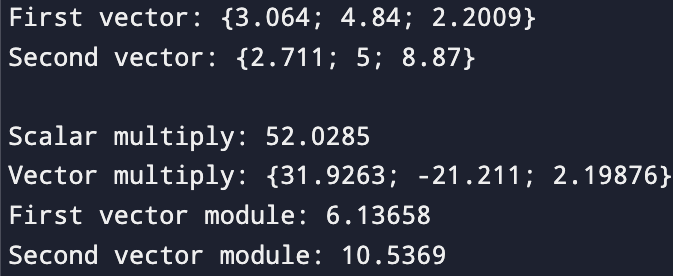
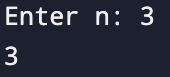

# Лабораторная работа 3
## Тема работы: Структуры, объединения, перечисления.
### Комплект 1: Структуры.

### Задача 1.1
#### Постановка задачи
Создать некоторую структуру с указателем на некоторую функцию в качестве поля. Вызвать эту функцию через имя переменной этой структуры и поле указателя на функцию.
#### Математическая модель
Отсутствует
#### Список идентификаторов
| Имя | Тип | Смысл |
| - | - | - |
| Message | struct | Структура с сообщением |
| message | void (*)(void) | Указатель в структуре на функцию |
| hello | struct Message | Экземпляр структуры |

#### Код программы
```c
#include <stdio.h>

struct Message {
    void (*message) (void);
};

void Hello() {
    printf("Hello, world!");
}

int main() {
    struct Message hello = {Hello};
    hello.message();
    return 0;
}
```
#### Результат работы

### Задача 1.2
#### Постановка задачи
Создать структуру для вектора в 3-х мерном пространстве. Реализовать и использовать в своей программе следующие операции над векторами:
- скалярное умножение векторов;
- векторное произведение;
- модуль вектора;
- распечатка вектора в консоли.

В структуре вектора указать имя вектора в качестве отдельного поля этой структуры.
#### Математическая модель
Скалярное произведение

$$
\overrightarrow{a} * \overrightarrow{b} = a_{x} * b_{x} + a_{y} * b_{y} + a_{z} * b_{z}
$$

Произведение векторов

$$
\overrightarrow{a} * \overrightarrow{b} = (a_{y}b_{z}-a_{z}b_{y}; a_{z}b_{x} - a_{x}b_{z}; a_{x}b_{y} - a_{y}b_{x} )
$$

Модуль вектора
$$
\left| \overrightarrow{a} \right| =\sqrt{a^{2}_{x} + a^{2}_{y} + a^{2}_{z}}
$$

#### Список идентификаторов
| Имя | Тип | Смысл |
| - | - | - |
| Vectors | struct | Структура трехмерного вектора |
| vector | char* | Название вектора |
| x | double | Ось вектора Х |
| y | double | Ось вектора Y |
| z | double | Ось вектора Z |
| vector1 | struct Vectors | Первый вектор |
| vector2 | struct Vectors | Второй вектор |
| scalar_multiply | double | Скалярное произвдедение векторов |
| vector_multiply1 | double | Первая часть произведения векторов |
| vector_multiply2 | double | Вторая часть произведения векторов |
| vector_multiply3 | double | Третья часть произведения векторов |
| vector_module1 | double | Модуль первого вектора |
| vector_module2 | double | Модуль второго вектора |
#### Код программы
```c
#include <stdio.h>
#include <math.h>

struct Vectors {
    char* vector;
    double x;
    double y;
    double z;
};

int main() {
    struct Vectors vector1 = {"First vector", 3.064, 4.84, 2.2009};
    struct Vectors vector2 = {"Second vector", 2.711, 5.0, 8.87};
    printf("%s: {%g; %g; %g}\n", vector1.vector, vector1.x, vector1.y, vector1.z);
    printf("%s: {%g; %g; %g}\n\n", vector2.vector, vector2.x, vector2.y, vector2.z);
    double scalar_multiply = vector1.x * vector2.x + vector1.y * vector2.y + vector1.z * vector2.z;
    
    double vector_multiply1 = vector1.y * vector2.z - vector1.z * vector2.y;
    double vector_multiply2 = vector1.z * vector2.x - vector1.x * vector2.z;
    double vector_multiply3 = vector1.x * vector2.y - vector1.y * vector2.x;
    
    double vector_module1 = sqrtf(vector1.x * vector1.x + vector1.y * vector1.y + vector1.z * vector1.z);
    double vector_module2 = sqrtf(vector2.x * vector2.x + vector2.y * vector2.y + vector2.z * vector2.z);
    printf("Scalar multiply: %g\n", scalar_multiply);
    printf("Vector multiply: {%g; %g; %g}\n", vector_multiply1, vector_multiply2, vector_multiply3);
    printf("%s module: %g\n", vector1.vector, vector_module1);
    printf("%s module: %g\n", vector2.vector, vector_module2);
    return 0;
}
```
#### Результат работы

### Задача 1.3
#### Постановка задачи
Вычислить, используя структуру комплексного числа, комплексную экспоненту $ exp(z) $ некоторого $ z \in \mathbb{C} $:

$$
exp(z) = 1 + z + \frac{1}{2!}z^2 + \frac{1}{3!}z^3 + \cdots + \frac{1}{n!}z^n
$$

#### Математическая модель
$$
exp(z) = 1 + z + \frac{1}{2!}z^2 + \frac{1}{3!}z^3 + \cdots + \frac{1}{n!}z^n
$$
#### Список идентификаторов

#### Код программы
```c
#include <stdio.h>

typedef struct {
    double real;
    double i;
} Complex;

void print_complex(Complex z) {
    if (z.i >= 0) {
        printf("%f + %fi", z.real, z.i);
    } else {
        printf("%f - %fi", z.real, -z.i);
    }
}

int main() {
    Complex z = {4.2, 2.28};
    int terms = 20;
    
    Complex result = {1.0, 0.0};
    Complex term = z;
    for (int n = 1; n < terms; n++) {
        result.real += term.real;
        result.i += term.i;
        double temp_real = term.real * z.real - term.i * z.i;
        double temp_i = term.real * z.i + term.i * z.real;
        term.real = temp_real  / (n + 1);
        term.i = temp_i / (n + 1);
    }
    printf("Result: ");
    print_complex(result);
    return 0;
}
```
#### Результат работы
;
### Задача 1.4
#### Постановка задачи
Используя так называемые "битовые" поля в структуре C, создать экономную структуру в оперативной памяти для заполнения даты некоторого события, например даты рождения человека. Ссылки на описание битовых полей:
- [https://en.cppreference.com/w/cpp/language/bit_field](https://en.cppreference.com/w/cpp/language/bit_field);
- [https://en.wikipedia.org/wiki/Bit_field](https://en.wikipedia.org/wiki/Bit_field).
#### Математическая модель
#### Список идентификаторов
#### Код программы
```c
#include <stdio.h>

typedef struct {
    unsigned int day: 5;
    unsigned int month: 4;
    unsigned int year: 7;
} Date;

int main() {
    Date birthday;
    int day, month, year;
    printf("Enter the day (1-31) of your birth: ");
    scanf("%d", &day);
    printf("Enter the month (1-12) of your birth: ");
    scanf("%d", &month);
    printf("Enter the year of your birth: ");
    scanf("%d", &year);
    if (day < 1 || day > 31 || month < 1 || month > 12 || year < 1900 || year > 2025) {
        printf("Incorrent data, try again!");
    } else {
        birthday.day = day;
        birthday.month = month;
        birthday.year = year - 1900;
        printf("Your birthday: %.2d.%.2d.%d", birthday.day, birthday.month, birthday.year + 1900);
    }
    return 0;
}
```
#### Результат работы
### Задача 1.5
#### Постановка задачи
Реализовать в виде структур двунаправленный связный список и совершить отдельно его обход в прямом и обратном направлениях с распечаткой значений каждого элемента списка.
#### Математическая модель
#### Список идентификаторов
#### Код программы
```c
#include <stdio.h>
#include <stdlib.h>

typedef struct Node {
    int data;
    struct Node* next;
    struct Node* prev;
} Node;

int main() {
    Node* head = NULL;
    Node* tail = NULL;
    
    Node* n1 = (Node*)malloc(sizeof(Node));
    Node* n2 = (Node*)malloc(sizeof(Node));
    Node* n3 = (Node*)malloc(sizeof(Node));
    
    head = n1;
    tail = n3;
    
    n1->data = 10; n1->next = n2; n1->prev = NULL;
    n2->data = 20; n2->next = n3; n2->prev = n1;
    n3->data = 30; n3->next = NULL; n3->prev = n2;
    
    printf("Прямой: ");
    Node* curr = head;
    while (curr) {
        printf("%d ", curr->data);
        curr = curr->next;
    }
    printf("\n");
    
    printf("Обратный: ");
    curr = tail;
    while (curr) {
        printf("%d ", curr->data);
        curr = curr->prev;
    }
    
    free(n1); 
    free(n2); 
    free(n3);
    return 0;
}
```
#### Результат работы

### Комплект 2: Объединения и перечисления
### Задача 2.1
#### Постановка задачи
Напишите программу, которая использует указатель на некоторое объединение union.
#### Математическая модель
Отсутствует
#### Список идентификаторов
#### Код программы
```c
#include <stdio.h>

union Number {
    int n;
};

int main() {
    union Number number;
    union Number* pointer = &number;
    
    pointer->n = 1;
    printf("Number: %d", pointer->n);
    return 0;
}
```
#### Результат работы

### Задача 2.2
#### Постановка задачи
Напишите программу, которая использует union для побайтовой распечатки типа unsigned long.
#### Математическая модель
#### Список идентификаторов
#### Код программы
```c
#include <stdio.h>

union ByteOutput {
    unsigned long value;
    unsigned char bytes[sizeof(unsigned long)];
};

int main() {
    union ByteOutput data;
    
    data.value = 206989966078601348;
    
    printf("Value: %lu \n", data.value);
    printf("Size: %zu bytes\n", sizeof(unsigned long));
    for (size_t i = 0; i < sizeof(unsigned long); i++) {
        printf("Byte %zu: %02x\n", i, data.bytes[i]);
    }
    return 0;
}
```
#### Результат работы
### Задача 2.3
#### Постановка задачи
Создайте перечислимый тип данных (enum) для семи дней недели и распечатайте на экране его значения, как целые числа.
#### Математическая модель
#### Список идентификаторов
#### Код программы
```c
#include <stdio.h>

enum DaysOfTheWeek {
    MONDAY = 1,    
    TUESDAY = 2,   
    WEDNESDAY = 3, 
    THURSDAY = 4,  
    FRIDAY = 5,    
    SATURDAY = 6,  
    SUNDAY = 7     
};

int main() {
    printf("Monday = %d\n", MONDAY);
    printf("Tuesday = %d\n", TUESDAY);
    printf("Wednesday = %d\n", WEDNESDAY);
    printf("Thursday = %d\n", THURSDAY);
    printf("Friday = %d\n", FRIDAY);
    printf("Saturday = %d\n", SATURDAY);
    printf("Sunday = %d\n", SUNDAY);
    
    return 0;
}
```
#### Результат работы
### Задача 2.4
#### Постановка задачи
Создайте так называемое размеченное объединение union, которое заключено в виде поля структуры struct вместе с ещё одним полем, которое является перечислением enum и служит индикатором того, что именно на текущий момент хранится в таком вложенном объединении. Создать и заполнить динамический массив таких структур с объединениями внутри, заполняя вспомогательное поле перечисления enum для сохранения информации о хранимом в каждом размеченном
объединении типе данных. Реализовать распечатку данных массива таких структур в консоль.
#### Математическая модель
#### Список идентификаторов
#### Код программы
```c
#include <stdio.h>
#include <stdlib.h>

typedef enum { 
    INT 
} Enum;

typedef union { 
    int i; 
} Union;

typedef struct { 
    Enum type; 
    Union data; 
} Struct;

int main() {
    int size = 3;
    Struct* arr = (Struct*)malloc(size * sizeof(Struct));
    
    arr[0].type = INT; 
    arr[0].data.i = 10;
    
    arr[1].type = INT; 
    arr[1].data.i = 20;
    
    arr[2].type = INT; 
    arr[2].data.i = 30;
    
    for (int i = 0; i < size; i++) {
        printf("Элемент %d: INT = %d\n", i, arr[i].data.i);
    }
    free(arr);
    return 0;
}
```
#### Результат работы
