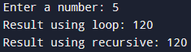
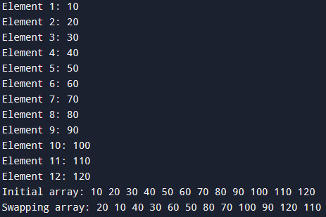
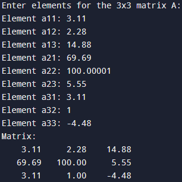
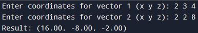
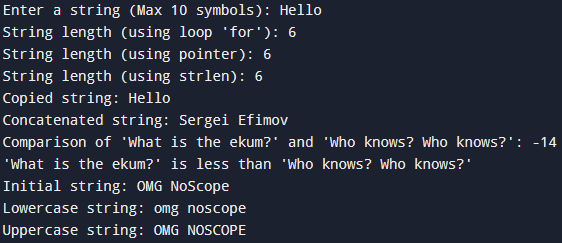
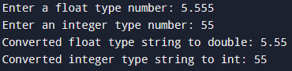

# Лабораторная работа 4
## Тема работы: Введение в функции. Базовая работа со строками (однобайтовыми).
### Комплект 1: Введение в функции
### Задача 1.1
#### Постановка задачи
Создайте две функции, которые вычисляют факториал числа:
- функцию, которая вычисляет факториал, используя цикл;
- функцию, которая вычисляет факториал, используя рекурсивный вызов самой себя.
Продемонстрируйте работу обеих функций.
#### Математическая модель

$$
n! = (n - 1)! * n
$$

#### Список идентификаторов
| Имя | Тип | Смысл |
| - | - | - |
| n | int | Число в функциях факториала |
| result | unsigned long long | Результат в функциях факториала |
| i | int | Шаг цикла в функции факториала |
| number | int | Факториал |
#### Код программы
```c
#include <stdio.h>

unsigned long long factorial_loop(int n) {
    if (n < 0) return 0;
    unsigned long long result = 1;
    for (int i = 1; i <= n; i++) {
        result *= i;
    }
    return result;
}

unsigned long long factorial_recursive(int n) {
    if (n < 0) return 0;
    if (n == 1 || n == 0) return 1;
    return n * factorial_recursive(n - 1);
}

int main() {
    int number;
    printf("Enter a number: ");
    scanf("%d", &number);
    
    printf("Result using loop: %llu\n", factorial_loop(number));
    printf("Result using recursive: %llu\n", factorial_recursive(number));
    return 0;
}
```
#### Результат работы

### Задача 1.2
#### Постановка задачи
 Объявите указатель на массив типа <span style='color: purple; font-weight: 700'>int</span> и динамически выделите память для 12-ти элементов. Напишите функцию, которая поменяет значения чётных и нечётных ячеек массива.
#### Математическая модель
Отсутствует
#### Список идентификаторов
#### Код программы
```c
#include <stdio.h>
#include <stdlib.h>

void swapper(int *arr) {
    for (int i = 0; i < 11; i += 2) {
        int temp = arr[i];
        arr[i] = arr[i + 1];
        arr[i + 1] = temp;
    }
}

int main() {
    int *arr;
    int size = 12;

    arr = (int *)malloc(size * sizeof(int));
    if (arr == NULL) {
        printf("Memory allocation failed!\n");
        return 1;
    }

    printf("Enter %d integers for the array:\n", size);
    for (int i = 0; i < size; i++) {
        printf("Element %d: ", i + 1);
        scanf("%d", &arr[i]);
    }

    printf("Initial array: ");
    for (int i = 0; i < size; i++) {
        printf("%d ", arr[i]);
    }
    printf("\n");

    swapper(arr);
    printf("Swapping array: ");
    for (int i = 0; i < size; i++) {
        printf("%d ", arr[i]);
    }
    printf("\n");

    free(arr);

    return 0;
}
```
#### Результат работы

### Задача 1.3
#### Постановка задачи
Создать две основные функции:
- функцию для динамического выделения памяти под двумерный
динамический массив типа <span style='color: purple; font-weight: 700'>double</span> — матрицу;
- функцию для динамического освобождения памяти под двумерный динамический массив типа <span style='color: purple; font-weight: 700'>double</span> — матрицу.
Создать две вспомогательные функции:
- функцию для заполнения матрицы типа <span style='color: purple; font-weight: 700'>double</span>;
- функцию для распечатки этой матрицы на экране.
Продемонстрировать работу всех этих функций в своей программе.
#### Математическая модель
Отсутствует
#### Список идентификаторов
#### Код программы
```c
#include <stdio.h>
#include <stdlib.h>

double** allocate_matrix(int rows, int cols) {
    double** matrix = (double**)malloc(rows * sizeof(double*));
    if (matrix == NULL) {
        return NULL;
    }
    
    for (int i = 0; i < rows; i++) {
        matrix[i] = (double*)malloc(cols * sizeof(double));
        if (matrix[i] == NULL) {
            for (int j = 0; j < i; j++) {
                free(matrix[j]);
            }
            free(matrix);
            return NULL;
        }
    }
    return matrix;
}


void free_matrix(double** matrix, int rows) {
    if (matrix == NULL) return;
    for (int i = 0; i < rows; i++) {
        free(matrix[i]); 
    }
    free(matrix); 
}

void fill_matrix(double** matrix, int rows, int cols) {
    printf("Enter elements for the %dx%d matrix A:\n", rows, cols);
    for (int i = 0; i < rows; i++) {
        for (int j = 0; j < cols; j++) {
            printf("Element a%d%d: ", i + 1, j + 1);
            scanf("%lf", &matrix[i][j]);
        }
    }
}

void print_matrix(double** matrix, int rows, int cols) {
    printf("Matrix:\n");
    for (int i = 0; i < rows; i++) {
        for (int j = 0; j < cols; j++) {
            printf("%8.2f ", matrix[i][j]);
        }
        printf("\n");
    }
}

int main() {
    int rows, cols;
    rows = 3;
    cols = 3;
    
    double** matrix = allocate_matrix(rows, cols);
    
    fill_matrix(matrix, rows, cols);
    print_matrix(matrix, rows, cols);
    free_matrix(matrix, rows);
    
    return 0;
}
```
#### Результат работы

### Задача 1.4
#### Постановка задачи
Создать функцию, которая вычисляет векторное произведение двух
векторов в декартовых координатах, используя указатели на соответствующие массивы.
#### Математическая модель
Отсутствует
#### Список идентификаторов
#### Код программы
```c
#include <stdio.h>
#include <stdlib.h>

void cross_product(double *vec1, double *vec2, double *result) {
    result[0] = vec1[1] * vec2[2] - vec1[2] * vec2[1];
    result[1] = vec1[2] * vec2[0] - vec1[0] * vec2[2]; 
    result[2] = vec1[0] * vec2[1] - vec1[1] * vec2[0]; 
}

int main() {
    double *vec1 = (double *)malloc(3 * sizeof(double));
    double *vec2 = (double *)malloc(3 * sizeof(double));
    double *result = (double *)malloc(3 * sizeof(double));

    if (vec1 == NULL || vec2 == NULL || result == NULL) {
        free(vec1);
        free(vec2);
        free(result);
        return 1;
    }

    printf("Enter coordinates for 1 vector (x y z): ");
    scanf("%lf %lf %lf", &vec1[0], &vec1[1], &vec1[2]);

    printf("Enter coordinates for 2 vector (x y z): ");
    scanf("%lf %lf %lf", &vec2[0], &vec2[1], &vec2[2]);

    cross_product(vec1, vec2, result);

    printf("Result: (%.2f, %.2f, %.2f)\n", result[0], result[1], result[2]);

    free(vec1);
    free(vec2);
    free(result);

    return 0;
}
```
#### Результат работы

### Комплект 2: Базовые операции со строками
### Задача 2.1
#### Постановка задачи
Создайте новую программу, где с клавиатуры вводится строка некоторой длины порядка 10 латинских символов (не используйте кириллицу) в классическую строку языка C, которая имеет вид массива <span style='color: purple; font-weight: 700'>char</span> my_string[MY_SIZE]. MY_SIZE определите с помощью директивы <span style='color: purple; font-weight: 700'>#define</span>. Значение MY_SIZE должно превышать длину вводимой строки с некоторым разумным запасом. Другие строки в этой задаче можете создавать либо также как статические массивы, либо как динамические массивы, но не забывайте освобождать от динамически
выделенную память с помощью функции <span style='color: purple; font-weight: 700'>void</span> free(<span style='color: purple; font-weight: 700'>void</span>∗ ptr); .
Выполните следующие действия и распечатайте результаты:
1.  Вычислите длину строки my_string, используя цикл <span style='color: purple; font-weight: 700'>for</span> и тот
факт, что в языке C такие строки имеют в конце специальный нулевой символ конца строки, представленный escape-последовательностью <span style='color: red; font-weight: 400'>'\0'</span> (<span style='color: red; font-weight: 400'>'...'</span> — это тип <span style='color: purple; font-weight: 700'>char</span>).
2. Сделайте тоже самое, что в пункте 1, но создайте указатель на
начало вашей строки и используйте операцию инкремента ++.
3. Используйте функции size_t strlen(<span style='color: purple; font-weight: 700'>const char</span>∗ str); или size_t strnlen (<span style='color: purple; font-weight: 700'>const char</span> ∗string, size_t maxlen); или size_t strnlen_s(<span style='color: purple; font-weight: 700'>const char</span> ∗str, size_t strsz); для получения размера строки в виде значения size_t (псевдоним unsigned int, спецификатор форматирования —"<span style='color: red; font-weight: 400'>%zu</span>"). Убедитесь, что ваш компилятор явно работает с опцией-std=c11 или с опцией для более позднего стандарта языка для поддержки функции strnlen_s.
4. Создайте вторую строку (второй массив) и скопируйте в неё строку my_string, используя функцию <span style='color: purple; font-weight: 700'>char</span> ∗strcpy(<span style='color: purple; font-weight: 700'>char</span> ∗dest, <span style='color: purple; font-weight: 700'>const char</span> ∗src); или <span style='color: purple; font-weight: 700'>char</span> ∗strncpy (<span style='color: purple; font-weight: 700'>char</span> ∗dest, <span style='color: purple; font-weight: 700'>const char</span> ∗src, size_t n);.
5. Создайте ещё две строки какого-либо размера и задайте их прямо
в коде без клавиатуры. Сделайте конкатенацию этих двух строк,
используя <span style='color: purple; font-weight: 700'>char</span> ∗strcat(<span style='color: purple; font-weight: 700'>char</span> ∗dest, <span style='color: purple; font-weight: 700'>const char</span> ∗src); или <span style='color: purple; font-weight: 700'>char</span> ∗strncat(<span style='color: purple; font-weight: 700'>char</span> ∗dest, <span style='color: purple; font-weight: 700'>const char</span> ∗src, size_t n);. Первую строку трактуйте как dest (destination) и подберите размер этого массива с запасом.
6. Сравните две новые строки, заданные в коде строковыми литералами, используя функцию int strcmp(const char ∗lhs, const char ∗rhs); или int strncmp (const char ∗s1, const char ∗s2, size_t n).
7. Задайте прямо в коде строку, в которой есть только латинские
символы в верхнем и нижнем регистре. Переведите строку полностью в нижний регистр и отдельно полностью в верхний регистр. Распечатайте каждый результат отдельно. Найдите сигнатуры подходящих функций (tolower и toupper), изучив базовые
однобайтовые строковые функции по ссылке
https://en.cppreference.com/w/c/string/byte.
#### Математическая модель
Отсутствует
#### Список идентификаторов
#### Код программы
```c
#include <stdio.h>
#include <stdlib.h>
#include <string.h>
#include <ctype.h>

#define SIZE 15

void lowercase(char *str) {
    for (int i = 0; str[i] != '\0'; i++) {
        str[i] = tolower(str[i]);
    }
}

void uppercase(char *str) {
    for (int i = 0; str[i] != '\0'; i++) {
        str[i] = toupper(str[i]);
    }
}

int main() {
    char string[SIZE];
    printf("Enter a string (Max 10 symbols): ");
    fgets(string, SIZE, stdin);
    
    // 1 Пункт
    int string_length = 0;
    for (int i = 0; string[i] != '\0'; i++) {
        string_length += 1;
    }
    printf("String length (using loop 'for'): %d\n", string_length);
    
    // 2 Пункт
    int string_length_ptr = 0;
    char *ptr = string;
    while (*ptr++ != '\0') {
        string_length_ptr += 1;
    }
    printf("String length (using pointer): %d\n", string_length_ptr);
   
    // 3 Пункт
    size_t string_length_strlen = strlen(string);
    printf("String length (using strlen): %zu\n", string_length_strlen);
    
    // 4 Пункт
    char string_copy[SIZE];
    strcpy(string_copy, string);
    printf("Copied string: %s", string_copy);
    
    // 5 Пункт
    char first_string[SIZE] = "Sergei";
    char second_string[] = " Efimov";
    strcat(first_string, second_string);
    printf("Concatenated string: %s\n", first_string);
    
    // 6 Пункт
    char cmp_first_string[] = "What is the ekum?";
    char cmp_second_string[] = "Who knows? Who knows?";
    int cmp_result = strcmp(cmp_first_string, cmp_second_string);
    printf("Comparison of '%s' and '%s': %d\n", cmp_first_string, cmp_second_string, cmp_result);
    if (cmp_result < 0) {
        printf("'%s' is less than '%s'\n", cmp_first_string, cmp_second_string);
    }
    if (cmp_result == 0) {
        printf("'%s' is equal to '%s'\n", cmp_first_string, cmp_second_string);
    }
    if (cmp_result > 0) {
        printf("'%s' is greater than '%s'\n", cmp_first_string, cmp_second_string);
    }
    
    // 7 Пункт
    char case_string[] = "OMG NoScope";
    char lower_string[SIZE];
    char upper_string[SIZE];
    strcpy(lower_string, case_string);
    strcpy(upper_string, case_string);
    lowercase(lower_string);
    uppercase(upper_string);
    printf("Initial string: %s\n", case_string);
    printf("Lowercase string: %s\n", lower_string);
    printf("Uppercase string: %s\n", upper_string);
    return 0;
}
```
#### Результат работы

### Задача 2.2
#### Постановка задачи
Конвертируйте введённые заданные как строки: число с плавающей
точкой (double) и целое число (int) в значения типа double и int, используя функциями atof и atoi. См. документацию по ссылке
https://en.cppreference.com/w/c/string/byte.
#### Математическая модель
Отсутствует
#### Список идентификаторов
#### Код программы
```c
#include <stdio.h>
#include <stdlib.h>
#include <string.h>

#define SIZE 20

int main() {
    char float_string[SIZE];
    char int_string[SIZE];
    
    printf("Enter a float type number: ");
    fgets(float_string, SIZE, stdin);
    
    printf("Enter an integer type number: ");
    fgets(int_string, SIZE, stdin);
    
    double float_value = atof(float_string);
    printf("Converted float type string to double: %.2f\n", float_value);
    
    int int_value = atoi(int_string);
    printf("Converted integer type string to int: %d\n", int_value);
    
    return 0;
}
```
#### Результат работы

### Задача 2.3
#### Постановка задачи
Создайте строку от 10 до 20 символов, используя только цифры, латинский буквы в разных регистрах пробельные символы и символы пунктуации. Организуйте цикл, где каждый символ подробно тестируется функциями типа int is∗(/∗... ∗/) (например — isdigit, ispunct). См. документацию по ссылке https://en.cppreference.com/w/c/string/byte. Оформите распечатку информации по каждому символу в виде списка на экране, чтобы можно было прочесть информацию о том что представляет из себя каждый символ (своими словами, в свободной форме). Постарайтесь использовать только латиницу.
#### Математическая модель
Отсутствует
#### Список идентификаторов
#### Код программы
#### Результат работы

### Ефимов Сергей Робертович, 1 курс, ИВТ-2, подгруппа 3