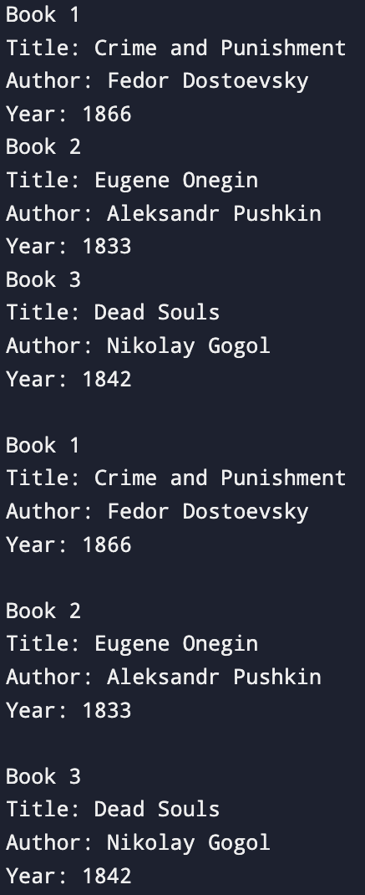

# Самостоятельная работа 1
## Задача 1. Динамический массив и вычисление среднего арифметического 
#### Постановка задачи
Напишите программу на языке Си, которая:
• Запрашивает у пользователя количество элементов массива (целое число N).
• Динамически выделяет память для массива из N элементов типа float.
• Заполняет массив значениями, введёнными с клавиатуры.
• Вычисляет и выводит среднее арифметическое всех элементов массива.
• При обращении к элементам массива используйте арифметику указателей (без оператора []).
• Освобождает выделенную память в конце работы программы.
#### Математическая модель
avg = sum / n, где
- avg - среднее арифметическое элементов;
- sum - сумма элементов
- n - количество элементов

#### Список идентификаторов
| Имя | Тип | Смысл |
| - | - | - |
| n | int | Количество элементов массива |
| avg | float | Среднее арифметическое элементов массива |
| sum | float | Сумма элементов массива |
| A | *float | Указатель на динамический массив |
| p | *float | Указатель на элемент массива |
| i | int | Шаг цикла |

#### Код программы
```c
#include <stdio.h>
#include <stdlib.h>

int main() {
    int n;
    float avg;
    float sum = 0.0f;
    printf("Enter the number of array elements: ");
    scanf("%d", &n);
    float *A = (float *)malloc(n * sizeof(float));
    if (A == NULL) {
        return EXIT_FAILURE;
    }
    float *p = A;
    for (int i = 0; i < n; i++, p++) {
        printf("Enter %d element: ", i+1);
        scanf("%f", p);
        sum += *p;
    }
    avg = sum / n;
    printf("Mean: %g\n", avg);
    free(A);
    return EXIT_SUCCESS;
}
```
#### Результат работы


## Задача 2. Каталог книг
#### Постановка задачи
Создайте структуру Book, которая содержит следующие поля:
• title – массив символов (строка) для хранения названия книг (максимум 50 символов);
• author – массив символов для хранения имени автора (максимум 50 символов);
• year – целое число, обозначающее год издания книги.
Напишите программу, которая:
• Создаёт массив из 3-х экземпляров структуры Book.
• Запрашивает у пользователя данные для каждой книги (название, автора и год издания).
• Выводит информацию обо всех книгах на экран, используя для этого отдельную функцию printBook(), которая
принимает указатель на структуру Book.
Подсказка: Используйте функцию fgets() для ввода строки printf() для форматированного вывода.
#### Математическая модель
Отсутствует
#### Список идентификаторов
| Имя | Тип | Смысл |
| - | - | - |
| Book | struct | Структура для информации про книги |
| title | char[50] | Название книги |
| author | char[50] | Автор книги |
| year | int | Год издания |
| books | struct Book[3] | Массив для книг |
| book | struct Book* | Указатель на структуру |
| i | int | Шаг цикла |
#### Код программы
```c
#include <stdio.h>

struct Book {
    char title[50];
    char author[50];
    int year;
};

void printBook(struct Book *book) {
    printf("Title: %s", (*book).title);
    printf("Author: %s", (*book).author);
    printf("Year: %d\n", (*book).year);
}

int main() {
    struct Book books[3];
    
    for (int i = 0; i < 3; i++) {
        printf("Book %d\n", i+1);
        printf("Title: ");
        fgets(books[i].title, 50, stdin);
        printf("Author: ");
        fgets(books[i].author, 50, stdin);
        printf("Year: ");
        scanf("%d%*c", &books[i].year);
    }
    for (int i = 0; i < 3; i++) {
        printf("\nBook %d\n", i+1);
        printBook(&books[i]);
    }
    
    return 0;
}
```
#### Результат работы


## Задача 3. Определение сезона по номеру месяца
#### Постановка задачи
Создайте перечисление Season со следующими значениями:
• WINTER, SPRING, SUMMER, AUTUMN

Напишите программу, которая:
• Запрашивает у пользователя номер месяца (целое число от 1 до 12).
• На основе введённого номера месяца определяет и выводит соответствующий сезон:
– Зима: декабрь (12), январь (1) и февраль (2);
– Весна: март (3), апрель (4) и май (5);
– Лето: июнь (6), июль (7) и август (8);
– Осень: сентябрь (9), октябрь (10) и ноябрь (11).
• Для определения сезона можно использовать условные операторы (if-else) или конструкцию switch.

Подсказка: Можно создать массив строк с названиями сезонов, индексируя его значением перечисления, или использовать switch-case для соответствия номера месяца и сезона.
#### Математическая модель
Отсутствует
#### Список идентификаторов
| Имя | Тип | Смысл |
| - | - | - |
| SEASON | enum | Перечисление сезонов года |
| month | int | Номер месяца |
| Season | SEASON | Сезон по переменной month |
| seasons[] | char* | Массив названий сезонов |

#### Код программы
```c
#include <stdio.h>

typedef enum {
    WINTER, SPRING, SUMMER, AUTUMN
} SEASON;

int main() {
    int month;
    SEASON Season;
    printf("Enter the month number (1-12): ");
    scanf("%d", &month);
    switch (month) {
        case 1: 
        case 2: 
        case 12:
            Season = WINTER;
            break;
        case 3: 
        case 4: 
        case 5:
            Season = SPRING;
            break;
        case 6:
        case 7:
        case 8:
            Season = SUMMER;
            break;
        case 9:
        case 10:
        case 11:
            Season = AUTUMN;
            break;
        default:
            printf("Enter a number between 1 and 12");
            return 1;
    }
    char* seasons[] = {"Winter", "Spring", "Summer", "Autumn"};
    printf("Season: %s", seasons[Season]);
    return 0;
}
```
#### Результат работы
